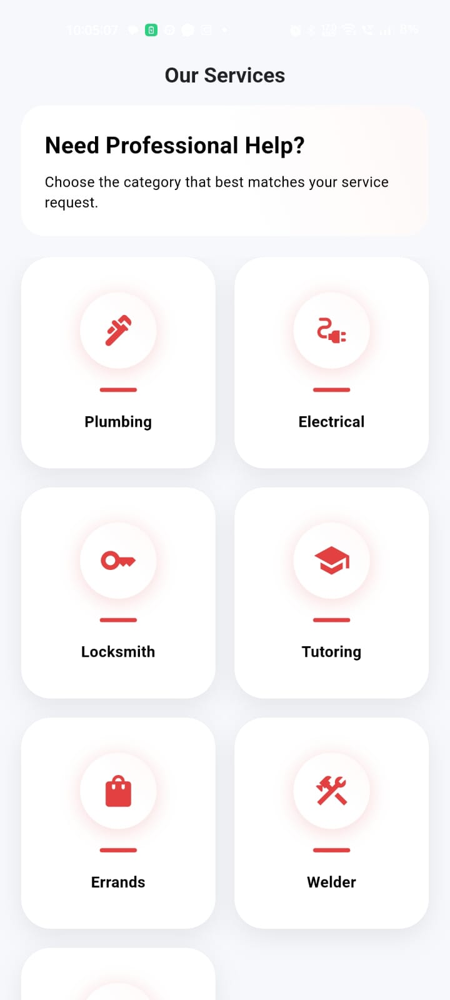
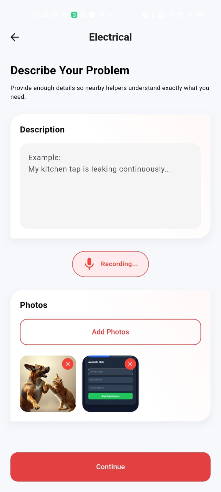

# Bartr App

A Flutter application showcasing service request booking and helper matching flows.

## Screenshots

<p align="center">
  
  
</p>


## Getting Started

### How to Run

1. **Prerequisites**: Ensure you have the Flutter SDK installed (`>= 3.11.5`).
2. **Install Dependencies**:
   ```bash
   flutter pub get
   ```
3. **Run the App**:
   ```bash
   flutter run
   ```

---

## Assumptions Made

- **State Management**: The project already had `provider` specified in `pubspec.yaml`. We assumed this is the standard for the codebase and refactored the interactive screens (`DescribeScreen` and `MatchingScreen`) into the MVVM pattern using `ChangeNotifier` and `ChangeNotifierProvider`.
- **Platform Permissions**: `image_picker` is used in `DescribeScreen` for uploading gallery/camera photos. It is assumed that the appropriate iOS (`NSPhotoLibraryUsageDescription`, `NSCameraUsageDescription`) and Android permissions are configured in their respective platform files.
- **Mock Behaviors**: The voice-to-text recording (3-second delay) and the search-helper timer (4-second delay) are mocked in their respective ViewModels to simulate asynchronous API requests.

---

## What We'd Do Differently with More Time

1. **Dependency Injection**: Currently, ViewModels are created inline in the widget tree using `ChangeNotifierProvider`. For a larger application, we would use a service locator (like `get_it`) to register and retrieve ViewModels. This allows cleaner mocking in unit tests.
2. **Abstract Repository/Use Case Layers**: Instead of mocking API behavior inside the ViewModels directly, we would abstract them behind Repository interfaces (e.g., `HelperRepository` and `SpeechRepository`) to separate business rules from concrete data sources.
3. **Decoupled Navigation**: We would implement a dedicated navigation service (or GoRouter) to remove imperative navigation logic (`Navigator.push(...)`) from the Views, making routing unit-testable and deep-link friendly.
4. **Codebase-wide MVVM**: Standardize the remaining screens (Screen 1, 3) to use the same MVVM pattern so that state management remains consistent throughout the project.
